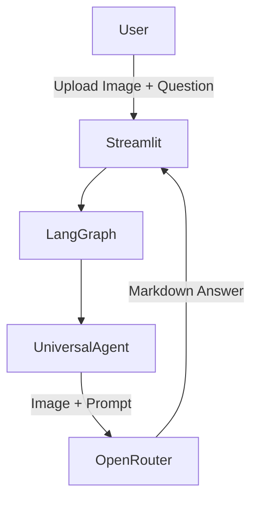

# 🖼️ Universal Image Agent

A **Streamlit app** powered by **LangGraph** and **OpenRouter** to analyze images (charts, tables, documents, UIs, etc.) and extract structured insights.

This agent can:

* OCR and reformat tables.
* Extract data points from **time series plots**, **bar charts**, **pie charts**, and other visualizations.
* Perform **Visual Question Answering** on general images.
* Summarize min/max values and trends.

---

## 🚀 Features

* **Multimodal:** Handles charts, tables, and documents in one flow.
* **Automatic:** Uses LangGraph to orchestrate the process.
* **Markdown Outputs:** Neatly formatted tables and summaries.
* **Interactive UI:** Built with Streamlit.

---

## 🛠️ Installation

### 1️⃣ Clone the repo

```bash
git clone https://github.com/<your-username>/universal-image-agent.git
cd universal-image-agent
```

### 2️⃣ Install dependencies

Use **Python 3.9+**:

```bash
pip install -r requirements.txt
```

**`requirements.txt`**

```
streamlit
langgraph
openai
pillow
```

---

## 🔑 Set up API keys

This project uses **OpenRouter** for model inference.

1. Get your **OpenRouter API Key** from: [https://openrouter.ai](https://openrouter.ai)
2. Add it to your environment:

   ```bash
   export OPENROUTER_API_KEY="your-key-here"
   ```

   Or replace directly in the code:

   ```python
   client = OpenAI(
       api_key="your-key",
       base_url="https://openrouter.ai/api/v1"
   )
   ```

---

## ▶️ Run the app

```bash
streamlit run app.py
```

Then open:
👉 **[http://localhost:8501](http://localhost:8501)**

---

## 📸 Usage

1. Upload an image (**charts, tables, UI screenshots, etc.**)
2. Ask a question like:

   * `"Show all data points"`
   * `"Extract the table"`
   * `"What is the max value and when did it occur?"`
3. Get neatly formatted **Markdown tables** and summaries.

---

## 🧩 How it works

* **LangGraph:** Defines a minimal state machine with a single agent node.
* **OpenRouter (Qwen2.5 VL 32B):** Performs multimodal reasoning.
* **Streamlit:** Interactive web UI.



---

## 📜 Example Output

**Input:** Prophet forecast chart
**Output:**

```markdown
### Max Value: 432 on 2024-03-15  
### Min Value: 98 on 2024-01-02  

| Date       | Series Name | Value |
|------------|-------------|-------|
| 2024-01-02 | yhat        | 98    |
| 2024-02-01 | yhat        | 250   |
| 2024-03-15 | yhat        | 432   |
```

---

## 📜 License

MIT License © 2025
